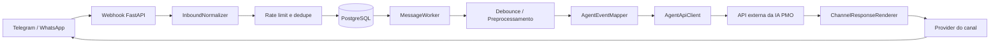

# PMO ProductPulse

`PMO_productpulse` não é o agente. Ele é a camada intermediária entre Telegram/WhatsApp e a API externa da IA PMO.

Este serviço não contém LangGraph, não guarda memória de negócio, não decide fluxo conversacional, não interpreta confirmação e não acessa o PMO Board. O worker conhece canais, mensagens, fila e transporte. A API da IA conhece conversa, intenção, fluxo, confirmação e Board.

## Responsabilidade

Fluxo de runtime:



## Configuração

Copie `.env.example` para `.env` e configure:

```env
AGENT_API_URL=http://pmo-ai-agent-api:8010
AGENT_API_TOKEN=
AGENT_API_ENDPOINT=/v2/agent/events
AGENT_TENANT_ID=default
AGENT_TIMEZONE=America/Sao_Paulo
```

Em produção, `AGENT_API_URL` e `AGENT_API_TOKEN` são obrigatórios. O token usa `SecretStr` e não deve aparecer em logs.

## Docker

Local:

```bash
docker compose up --build
```

Produção:

```bash
docker network create pmo_ai_network
docker compose -f docker-compose.prod.yml up --build -d
```

O worker fica nas redes `pmo_agent` e `pmo_ai_network`. A conexão direta com a rede do Board foi removida.

## Migrations

API e worker executam:

```bash
python -m app.database.migrate
```

antes de iniciar. A tabela `schema_migrations` controla quais arquivos SQL já foram aplicados. A tabela `task_actions` permanece apenas como legado histórico e não recebe novos registros.

## Endpoints

`GET /health` valida somente que o processo está vivo.

`GET /ready` valida banco, fila e configuração da API da IA.

`POST /webhooks/telegram` recebe mensagens e callbacks Telegram. Callbacks recebem ACK imediato via `answerCallbackQuery`.

`POST /webhooks/whatsapp` recebe eventos WhatsApp.

`GET /debug/conversations/{conversation_id}` mostra conversa, mensagens e despachos para a API da IA.

## Testes

```bash
pytest
python -m compileall app
```

Se o `ruff` estiver instalado:

```bash
ruff check app
ruff format --check app
```

Documentação detalhada:

- [Worker Architecture](docs/worker-architecture.md)
- [Agent API Integration](docs/agent-api-integration.md)
- [Event Contract](docs/event-contract.md)
- [Deployment With AI API](docs/deployment-with-ai-api.md)
- [Remove Local Business Logic](docs/migration-remove-local-business-logic.md)
