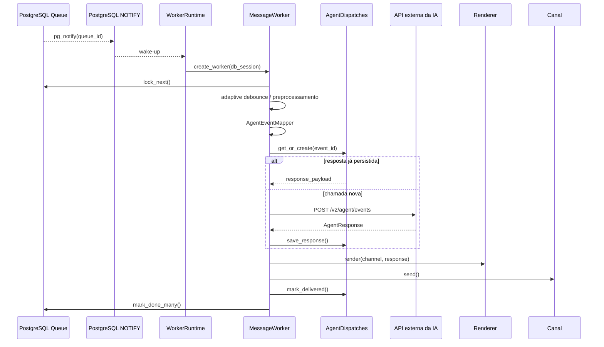

# Worker Architecture

O `WorkerRuntime` vive durante todo o processo e reutiliza `httpx.Client`, `AgentApiClient`, renderers e providers. O `MessageWorker` continua DB-scoped: cada processamento recebe uma sessão SQLAlchemy válida e cria repositórios e serviços transacionais a partir dela.

O PostgreSQL continua sendo a fila durável. `LISTEN/NOTIFY` é apenas wake-up: o payload contém somente `queue_id`, e o worker sempre consulta `message_queue` com `FOR UPDATE SKIP LOCKED`.



O worker não importa serviços de Board, confirmação local, agente mockado ou repositório de ações.

Falha de entrega ao canal depois de resposta da IA não chama a IA novamente. O `response_payload` fica salvo em `agent_dispatches` e o retry repete somente o outbound.

Configurações principais:

```env
QUEUE_NOTIFY_ENABLED=true
QUEUE_NOTIFY_CHANNEL=pmo_productpulse_queue
WORKER_FALLBACK_POLL_SECONDS=10
WORKER_MAX_DRAIN_BATCH=100
DEBOUNCE_ADAPTIVE_ENABLED=true
DEBOUNCE_MIN_MS=700
DEBOUNCE_MAX_MS=2500
DEBOUNCE_INCREMENT_MS=400
DEBOUNCE_MAX_MESSAGES=8
```

Rollback operacional:

```env
QUEUE_NOTIFY_ENABLED=false
DEBOUNCE_ADAPTIVE_ENABLED=false
```

Com notify desativado, o worker volta ao polling com backoff. Com debounce adaptativo desativado, usa `DEBOUNCE_SECONDS` e `DEBOUNCE_MAX_SECONDS`.
