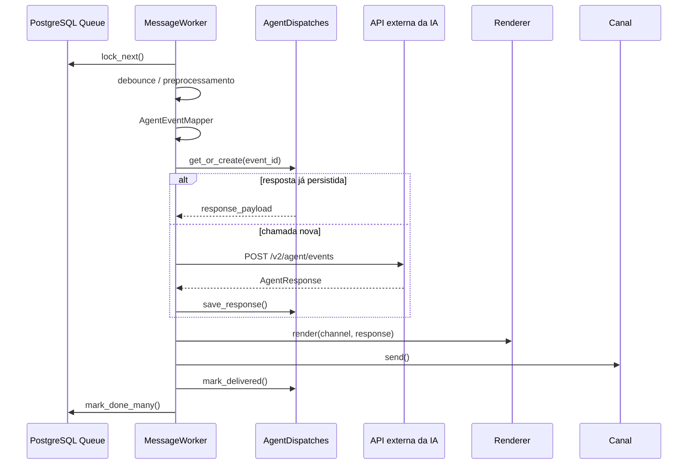

# Worker Architecture

O `MessageWorker` processa transporte, não negócio.

O worker não importa serviços de Board, confirmação local, agente mockado ou repositório de ações.

Falha de entrega ao canal depois de resposta da IA não chama a IA novamente. O `response_payload` fica salvo em `agent_dispatches` e o retry repete somente o outbound.
